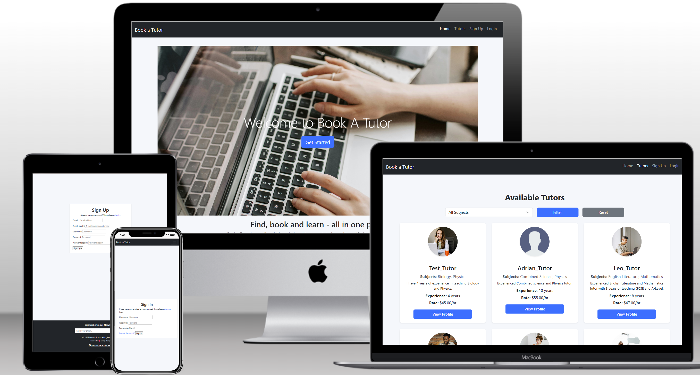
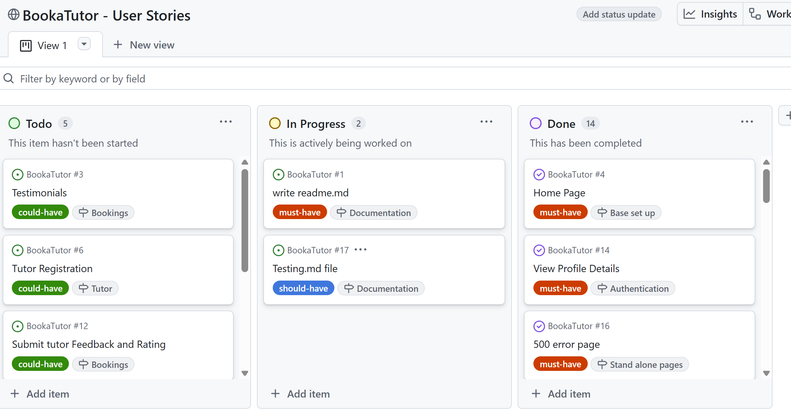
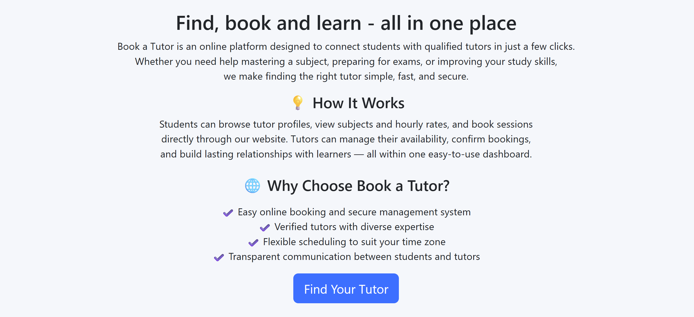
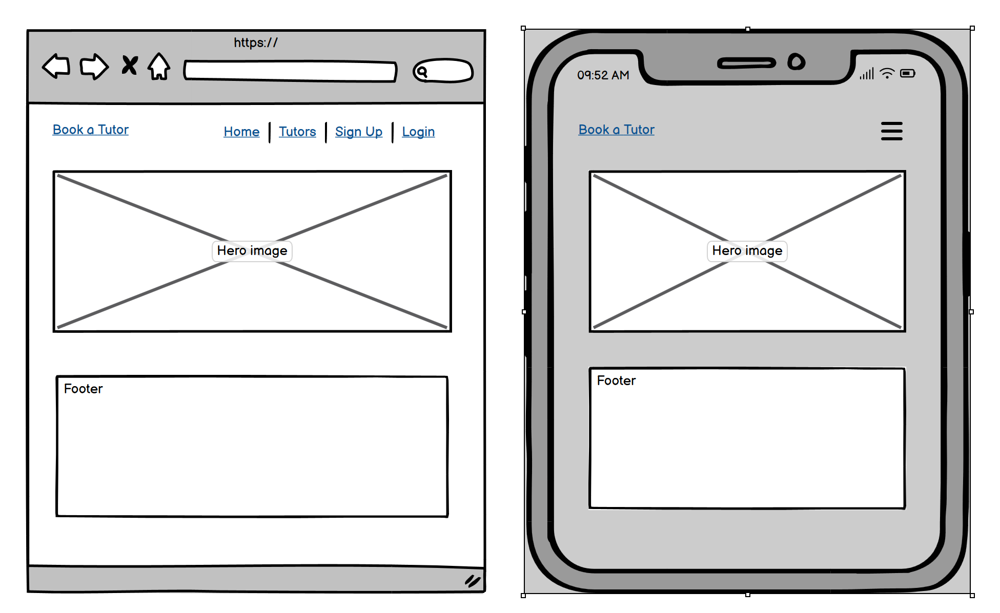
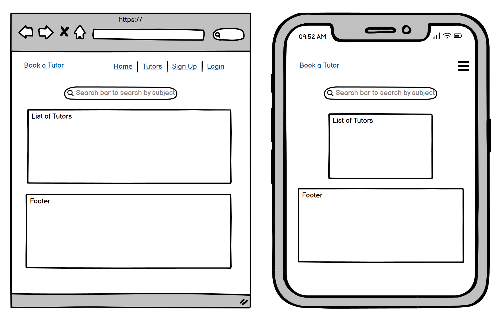
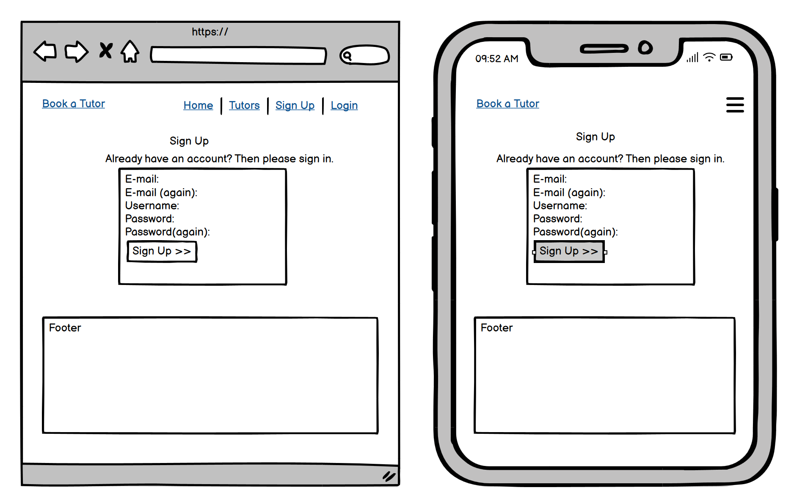
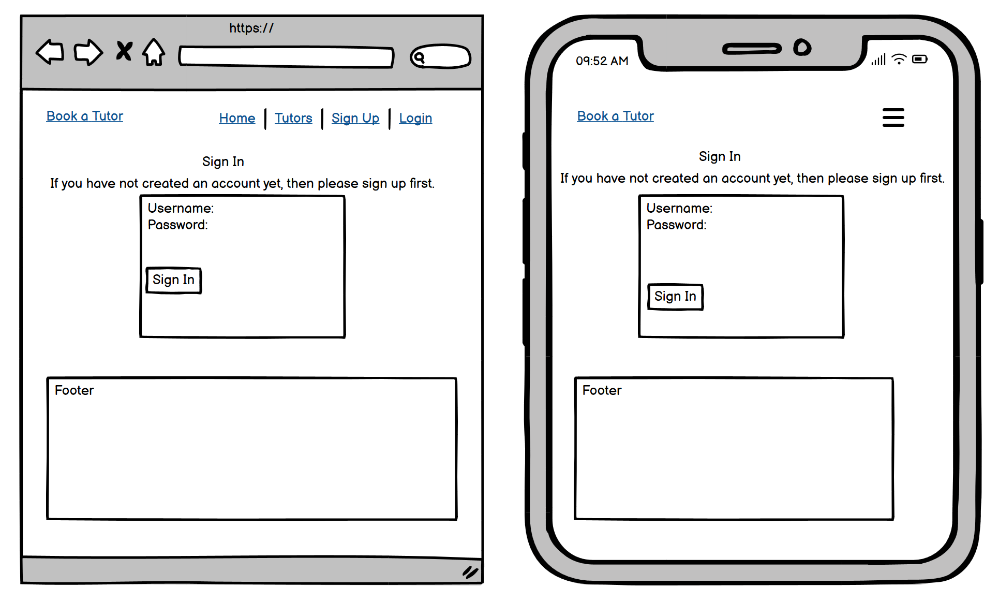

# Book a Tutor

Book a Tutor is a fictional learner-first platform that helps them to connect with verified tutors online. We make easy to find, book and learn - all in one place.
The live link can be found here: [Live Site - Book a Tutor](https://book-a-tutor-e586c5d4d680.herokuapp.com/)



## Table of Contents
- [Book a Tutor ](#Book-a-Tutor)
  - [Table of Contents](#table-of-contents)
- [User-Experience-Design](#user-experience-design)
  - [The-Strategy-Plane](#the-strategy-plane)
    - [Site-Goals](#site-goals)
    - [Agile Planning](#agile-planning)
      - [Epics](#epics)
      - [User Stories](#user-stories)
  - [The-Scope-Plane](#the-scope-plane)
  - [The-Structure-Plane](#the-structure-plane)
    - [Features](#features)
    - [Features Left To Implement](#features-left-to-implement)
  - [The-Skeleton-Plane](#the-skeleton-plane)
    - [Wireframes](#wireframes)
    - [Database-Design](#database-design)
    - [Security](#security)
  - [The-Surface-Plane](#the-surface-plane)
    - [Design](#design)
    - [Imagery](#imagery)
  - [Technolgies](#technolgies)
  - [Testing](#testing)
  - [Deployment](#deployment)
    - [Development Setup](#development-setup)
    - [Version Control](#version-control)
    - [Heroku Deployment](#heroku-deployment)
    - [Run Locally](#run-locally)
    - [Fork Project](#fork-project)
  - [Media](#media)
  - [Credits](#credits)


# User-Experience-Design

## The-Strategy-Plane

### Site-Goals

The site is aimed to help tutors efficiently manage their availability and upcoming student bookings, with the ability to confirm, reject, edit, or cancel sessions as necessary.

The platform also aims to provide students with a simple and hassle-free way to find qualified tutors, schedule lessons online, and make secure payments. Students can also update or cancel their bookings easily through their dashboard.

### Agile Planning

This project was developed using agile methodologies by delivering small features in incremental sprints. spaced out evenly over four weeks.

All projects were assigned to epics, prioritized under the labels, Must have, should have, could have."Must have" stories were completed first, "should haves" and then finally "could haves". It was done this way to ensure that all core requirements were completed first to give the project a complete feel, with the nice to have features being added should there be capacity.

The Kanban board was created using github projects and can be located [here](https://github.com/users/Neelp20/projects/18)
and can be viewed to see more information on the project cards. All stories except the documentation tasks have a full set of acceptance criteria in order to define the functionality that marks that story as complete.



#### Epics

The project had 7 main Epics (milestones):

**EPIC 1 - Base Setup**

The base setup epic is for all stories needed for the base set up of the application. Without the base setup, the app would not be possible so it was the first epic to be delivered as all other features depend on the completion of the base setup.

**EPIC 2 - Stand alone Pages**

The stand alone pages epic is for small pages that did not have enough stories to warrant their own full epics. Instead of creating epics for tiny features, these small deliverables were all added under this epic.

**EPIC 3 - Authentication Epic**

The authentication epic is for all stories related to the registration, login and authorization of views. This epic provides critical functionality and value as without it the staff would not be able to managed the bookings securely without regular site visitors also being able to see and perform actions.

**EPIC 4 - Tutors**

The Tutors epic is for all stories that relate to the creating, deleting, editing and viewing of list of tutors. This allows staff to view list of Tutors and to manage them.

**EPIC 5 - Bookings**

The booking epic is for all stories that relate to creating, viewing, updating and deleting bookings. This allows the tutors to easily view upcoming bookings, manage the bookings and also for students to book and manage their own bookings.

**EPIC 6 - Deployment Epic**

This epic is for all stories related to deploying the app to heroku so that the site is live for staff and user.

**EPIC 7 - Documentation**

This epic is for all document related stories and tasks that are needed to document the software development lifecycle of the application. It aims to deliver quality documentation, explaining all stages of development and necessary information on running, deploying and using the application.

#### User Stories

The following user stories (by epic) were completed:

**EPIC 1 - Base Setup**

As a developer, I need to create the base.html page and structure so that other pages can reuse the layout

As a developer, I need to create static resources so that images, css and javascript work on the website

As a developer, I need to set up the project so that it is ready for implementing the core features

As a developer, I need to create the footer with social media links 

As a developer, I need to create the navbar so that users can navigate the website from any device

**EPIC 2 - Stand alone Pages**

As a developer, I need to implement a 404 error page to alert users when they have accessed a page that doesn't exist

As a developer, I need to implement a 500 error page to alert users when an internal server error occurs

As a developer, I need to implement a 403 error page to redirect unauthorised users to so that I can secure my views

As a owner, I would like a home page so that users/students can view information

**EPIC 3 - Authentication Epic**

As a developer, I need to implement allauth so that users can sign up and have access to the websites features

As a Site Owner, I want users to verify their email when registering an account so that I can ensure that a valid email address is being used.

As a site owner, I would like the allauth pages customized to that they fit in with the sites styling.

**EPIC 4 - Tutors**

As a staff user, I want to be able to create a new tutor/time slots whenever it is required

As a user, I would like to be able to view list of tutors with subject experience so that I can decide if I would like to book a tutor

As a staff user, I want to be able to edit a tutor/time slot details when updates are needed

As a staff user, I would like to receive feedback when I create or update tutors/time slots so that I can see they have worked

As a staff user, I want to be able to delete a tutors/time slots when it is no longer needed

**EPIC 5 - Booking**

As a user, I would like to be able to create a book a tutor online

As a user, I would like to view my bookings when I need to check the information

As a user, I would like to be able to edit a booking so that I can make changes when needed

As a user, I would like to receive feedback when I create a booking or edit one so I know it was completed successfully

As a staff user, I want to be able to view all bookings

As a user I would like to delete a booking when I no longer require it

**EPIC 6 - Deployment Epic**

As a developer, I need to set up whitenoise so that my static files are served in deployment

As a developer, I need to deploy the project to heroku so that it is live for users

**EPIC 7 - Documentation**

Tasks:

* Complete readme documentation
* Complete testing documentation write up

## The-Scope-Plane

* Responsive Design - Site should be fully functional on all devices from 320px up
* Hamburger menu for mobile devices
* Ability to perform CRUD functionality on Bookings page
* Restricted role based features
* Home page with hero image
* Footer with Newsletter subscription

## The-Structure-Plane

### Features

``USER STORY - As a developer, I need to create the navbar so that users can navigate the website from any device``

Implementation:

**Navigation Menu**

 The Navigation contains links for Home, Tutors has allauth options.

 The following navigation items are available on all pages:
  * Home -> index.html - Visible to all
  * Bookings (Drop Down):
    * Create Booking -> bookings.html - Visible to logged in users
    * Upcoming BookingS -> manage_bookings.html - Visible to logged in users
    * Past BookingS -> past_bookings.html - Visible to logged in users
    * All Bookings(Admin) --> admin_manage_bookings.html - visible to admin only
  * Tutors --> tutors_list.html - Visible to all
  * Tutors Dashboard:
    * My Students - tutor_bookings.html -> Visible to logged in tutors only
  * My Profile:
    * View Profile - profile_detail.html -> Visible to logged in user and tutors
    * Edit Profile - profile_edit.html -> Visible to logged in user and tutors
  * Login -> login.html - Visible to logged out users
  * Register -> signup.html - Visible to logged out users
  * Logout -> logout.html - Visible to logged in users

The navigation menu is displayed on all pages and drops down into a hamburger menu on smaller devices. This will allow users to view the site from any device and not take up too much space on mobile devices.


``USER STORY - As a owner, I would like a home page so that customers can visit my website``

Implementation:

**Home Page**

The home page contains a hero image and the button which allow the user a quick way to the respective page in the middle of the hero image. This will immediately make it evident to the user, what the purpose of the website is.
Under the Hero image, the goal and reason to book us is given with one button. This button will allow user a quick way to explore tutors page.




``USER STORY - As a developer, I need to create the footer with social media links and newsletter subscription so that the user can follow us and/or subscribe``

Implementation:

**Footer**

A footer has been added to the bottom of the site, this contains a Facebook link so that users can follow the Book a Tutor on social media if they want to keep up to date with special offers not advertised on the website. These icons have aria-labels added to ensure users with assistive screen reading technology know what the purpose of the links are for. They also open in new tabs as they lead users away from the site.
A Footer has a Newsletter subscription option also which allows users to subscribe by giving email address only.


``USER STORY -As a user, I would like to be able to view list of tutors and their bio so that I can decide if I would like to book``

``USER STORY -As a user, I would like to be able to search by subject on tutors page so that I can decide if I would like to book``


### Features Left To Implement
- In a future release I would like to implement a page for tutors, which will give them the option to become a tutor by registering online without going through django admin. 
- I will also like to add multiple Tutors pages.

## The-Skeleton-Plane

### Wireframes

- Home page




- Tutors page



- Sign Up page



- Sign In page



### Database-Design

The database was designed to allow CRUD functionality to be available to registered users, when signed in. The user model is at the heart of the application as it is connected the the main booking and tutors, linked by primary/foreign key relationships.

One-to-Many: A user can make multiple bookings

Many-to-Many: Tutors can have multiple bookings

Foreign Keys: Used to link bookings to users and tutors

Authentication: Managed via Django’s built-in and Allauth models

Entity relationship diagram was created using [DBeaver](https://dbeaver.io/download/) and shows the schemas for each of the models and how they are related.


### Security

Views were secured by using the django class based view mixin, UserPassesTextMixin. A test function was created to use the mixin and checks were ran to ensure that the user who is trying to access the page is authorized. Any staff restricted functionality, user edit/delete functionality listed in the features was secured using this method.

Environment variables were stored in an env.py for local development for security purposes to ensure no secret keys, api keys or sensitive information was added to the repository. In production, these variables were added to the heroku config vars within the project.


## The-Surface-Plane
### Design

### Imagery

The hero image was taken from Pexels which is a royalty free image site.

## Technolgies

- HTML
  - The structure of the Website was developed using HTML as the main language.
- CSS
  - The Website was styled using custom CSS in an external file.
- JavaScript
  - A touch of JavaScript was used for client-side input control to enhance form usability.
- Python
  - Python was the main programming language used for the application using the Django Framework.
- Visual Studio Code
  - The website was developed using Visual Studio Code IDE
- GitHub
  - Source code is hosted on GitHub
- Git
  - Used to commit and push code during the development of the Website
- Font Awesome
  - This was used for various icons throughout the site
- Favicon.io
  - favicon files were created at https://favicon.io/favicon-converter/
- balsamiq
  - wireframes were created using balsamiq from https://balsamiq.com/wireframes/desktop/#
- freeconvert.com
  - This was used to compress the images used in the website for optimal load times
- stripe.com
  - for payments

  **Python Modules Used**

* Django Class based views (ListView, UpdateView, DeleteView, CreateView) - Used for the classes to create, read, update and delete
* Mixins (LoginRequiredMixin, UserPassesTestMixin) - Used to enforce login required on views and test user is authorized to perform actions
* messages - Used to pass messages to the toasts to display feedback to the user upon actions
* reverse_lazy - Used to define redirect URLs (like success_url) in class-based views without causing circular import issues.
* timezone - timezone was used in order to add time slots for tutors.
* method_decorator - Used to wrap them with access restrictions.
* UserProfile - used to create userprofile based on role(tutors/student)
* staff_member_required - Used to restrict access to certain views only for staff users

**External Python Modules**

* asgiref==3.8.1 - Used internally by Django to support asynchronous features
* certifi==2025.6.15 - Used to secure HTTP requests by providing up-to-date SSL certificates
* cffi==1.17.1 - Used for calling C code from Python - required by cryptography
* charset-normalizer==3.4.2 - Used to detect and normalize text encoding; required by requests
* cloudinary==1.36.0 - Cloundinary was used to make sure the images are server on deployed server too.
* cryptography==45.0.4 - Installed as dependency with another package
* defusedxml==0.7.1 - Installed as dependency with another package
* dj-database-url==0.5.0 - Used to parse database url for production environment
* Django==4.2.23 - Framework used to build the application
* django-allauth==0.57.0 - Used for the sites authentication system, sign up, sign in, logout, password resets ect.
* dj3-cloudinary-storage==0.0.6 - Storage system to work with cloudinary
* django-crispy-forms==2.4 - Used to style the forms on render
* gunicorn==20.1.0 - Installed as dependency with another package
* idna==3.10 - Installed as dependency with another package
* oauthlib==3.3.1 - Installed as dependency with another package
* packaging==25.0- Installed as dependency with another package
* pillow==10.3.0 - Installed to use ImageField 
* psycopg2==2.9.10 - Needed for heroku deployment
* pycparser==2.22 - Installed as dependency with another package
* PyJWT==2.10.1 - Installed as dependency with another package
* python3-openid==3.2.0 - Installed as dependency with another package
* pytz==2025.2 - Installed as dependency with another package
* requests==2.32.4 - Installed as dependency with another package
* requests-oauthlib==2.0.0 - Installed as dependency with another package (allauth authentication)
* six==1.17.0 - Installed as dependency with another package
* sqlparse==0.5.3 - Installed as dependency with another package
* stripe==13.0.1 - To integrate stripe payment on booking page
* typing_extensions==4.15.0 - Installed as dependency with another package
* urllib3==1.26.20 - Installed as dependency with another package
* whitenoise==5.3.0 - Used to serve static files directly without use of static resource provider like cloundinary


## Testing

Test cases and results can be found in the [TESTING.md](TESTING.md) file. This was moved due to the size of the file.

## Deployment

### Development Setup

This project uses a Python virtual environment located at `.venv`.

#### Using VS Code (Recommended)
- VS Code is configured to automatically use this environment via `.vscode/settings.json`.
- If you open the project folder in VS Code, it will activate the environment automatically.

#### Manual Setup (If Needed)

If the environment doesn’t activate automatically, you can activate it manually by pasting it on terminal:
`.venv\Scripts\Activate.ps1`


### Version Control

The site was created using the Visual Studio Code editor and pushed to github to the remote repository ‘Gars-Steakhouse’.

The following git commands were used throughout development to push code to the remote repo:

```git add <file>``` - This command was used to add the file(s) to the staging area before they are committed.

```git commit -m “commit message”``` - This command was used to commit changes to the local repository queue ready for the final step.

```git push``` - This command was used to push all committed code to the remote repository on github.

### Heroku Deployment

The site was deployed to Heroku. The steps to deploy are as follows:

- Navigate to heroku and create an account
- Click the new button in the top right corner
- Select create new app
- Enter app name
- Select region and click create app
- Click the resources tab and search for Heroku Postgres
- Select hobby dev and continue
- Go to the settings tab and then click reveal config vars
- Add the following config vars:
  - SECRET_KEY: (Your secret key)
  - DATABASE_URL: (This should already exist with add on of postgres)
  - CLOUNDINARY_URL: (cloudinary api url)
- Click the deploy tab
- Scroll down to Connect to GitHub and sign in / authorize when prompted
- In the search box, find the repositoy you want to deploy and click connect
- Scroll down to Manual deploy and choose the main branch
- Click deploy

The app should now be deployed.

The live link can be found here: [Live Site](https://book-a-tutor-e586c5d4d680.herokuapp.com/)

### Run Locally

Navigate to the GitHub Repository you want to clone to use locally:

- Click on the code drop down button
- Click on HTTPS
- Copy the repository link to the clipboard
- Open your IDE of choice (git must be installed for the next steps)
- Type git clone copied-git-url into the IDE terminal

The project will now have been cloned on your local machine for use.

### Fork Project

Most commonly, forks are used to either propose changes to someone else's project or to use someone else's project as a starting point for your own idea.

- Navigate to the GitHub Repository you want to fork.

- On the top right of the page under the header, click the fork button.

- This will create a duplicate of the full project in your GitHub Repository.

### Media
* All the free images/hero image used on the site were gotten from https://www.pexels.com/

## Credits
* My Mentor [Rory_Patrick_Mentor](https://discord.com/channels/@me/1427245345082970224) for his insighful guidance
* Code Institute LMS on various stages.

