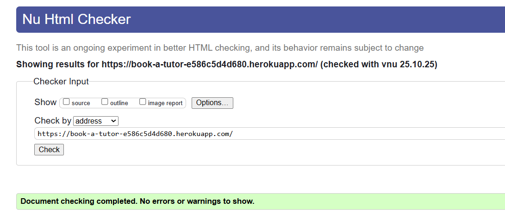
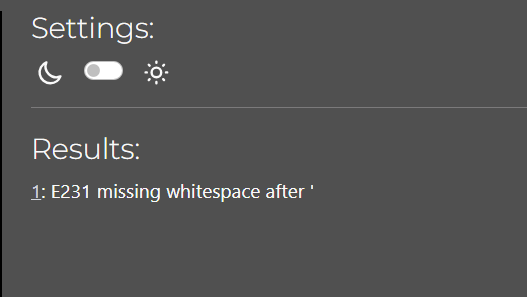
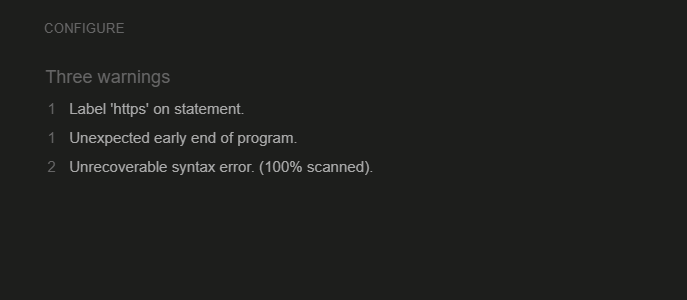
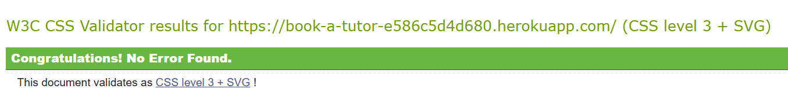
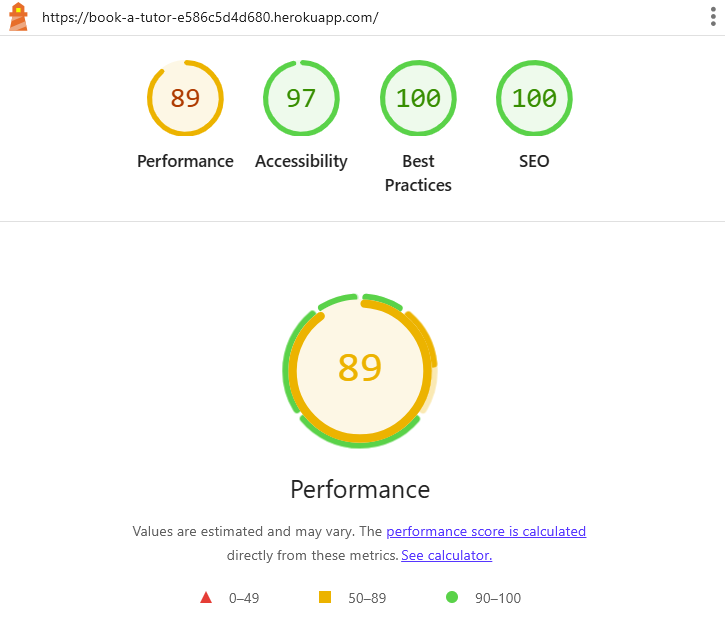
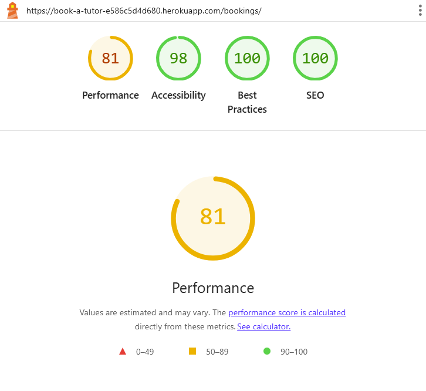
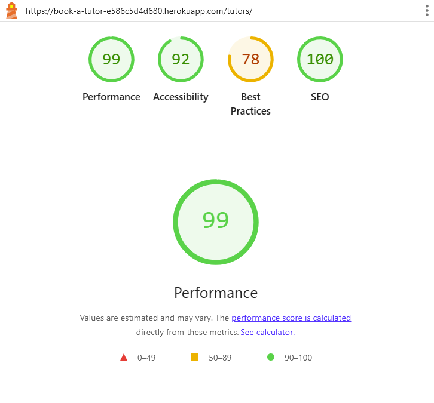

## Functional Testing

**Authentication**

Description:

Ensure a user can sign up to the website

Steps:

1. Navigate to [Book a Tutor](https://book-a-tutor-e586c5d4d680.herokuapp.com/) and click Register
2. Enter email, username and password 
3. Click Sign up

Expected:

Registration is successful, no need for approve from admin.no link is sent to confirm

Actual: 

Registration is successful, no link is received to confirm

Description:

Ensure a user can log in once signed up

Steps:
1. Navigate to [The Wooden Spoon](https://the-wooden-spoon-cfb803cde318.herokuapp.com/)
2. Enter login detailscreated in previous test case
3. Click login

Expected:

User is successfully logged in and redirected to the home page

Actual:

User is successfully logged in and redirected to the home page

Description:

Ensure a user can sign out

Steps:

1. Login to the website
2. Click the logout button
3. Click confirm on the confirm logout page

Expected:

User is logged out

Actual:

User is logged out

**Booking page**

Description:

Ensure a new booking can be created.

Steps:

1. Navigate to [page](https://book-a-tutor-e586c5d4d680.herokuapp.com/) - Login is required first.
2. Enter the following:
    - username: test@student
    - Your password: 
3. Click sign in
4. Bookings page:
    - Create bookings
    - Select tutor from dropdown
    - Enter subject
    - Any message
    - Book now

Expected:

Form successfully submits and alert is shown to the user of successful booking.

Actual:

Form successfully submits and a alert is shown to the user of successful booking.

**Edit Booking page**

Description:

Ensure a booking can be edited.

Steps:

1. Navigate to [Manage booking page](https://book-a-tutor-e586c5d4d680.herokuapp.com/) - Login is required first.
2. Enter the following:
    - username: test@student
    - Your password: 
3. Click sign in
4. Bookings page:
    - Manage bookings
    - Edit
    - user gets confirmation post edit/delete

Expected:

Form successfully submits and alert is shown to the user of successful editing/deleting.

Actual:

Form successfully submits and a alert is shown to the user of successful editing/deleting.

**Tutor Page**

Description:

Search option by subjects on tutors page

Steps:

1. Navigate to [Tutors page](https://book-a-tutor-e586c5d4d680.herokuapp.com/) - Login is required first.
2. Enter the following details:
    - Select subject from the dropdown
    - It shows the tutors, whoch teaches that subject

Expected:

Page should show the tutors teaching that particular subject

Actual:

Page has shown the tutors teaching that subject

**Navigation Links**

Testing was performed to ensure all navigation links on the respective pages, navigated to the correct pages as per design. This was done by clicking on the navigation links on each page.

* Home -> index.html - Visible to all
  * Bookings (Drop Down):
    * Create Booking -> bookings.html - Visible to logged in users
    * Upcoming BookingS -> manage_bookings.html - Visible to logged in users
    * Past BookingS -> past_bookings.html - Visible to logged in users
    * All Bookings(Admin) --> admin_manage_bookings.html - visible to admin only
  * Menus (Drop Down):
    * View Menus -> menu.html - Visible to all
    * Create Menu -> create_menu.html - Visible to staff
    * Create Menu Item -> create_menu_items.html - Visible to staff
    * Create Allergy Label -> create_allergy_label.html - Visible to staff
    * Manage Menu -> manage_menu.html - Visible to staff
  * Login -> login.html - Visible to logged out users
  * Register -> signup.html - Visible to logged out users
  * Logout -> logout.html - Visible to logged in users

All navigation links directed to the corect pages as expected.

**Footer**

Testing was performed on the footer links by clicking the font awesome icons and ensuring that the facebook icon opened facebook in a new tab. These behaved as expected.

## Negative Testing

Tests were performed on the create booking to ensure that:

1. A userr cannot book a date in the past
2. A user cannot book for less than 24hrs.
3. Forms cannot be submitted when required fields are empty

## Unit Testing

Due to time constraints, automated testing was not implemented. However, extensive manual testing was performed across key user journeys such as booking reservations, navigating the menu, user authentication, and error handling to ensure reliable functionality and smooth user experience.

## Accessibility

[Wave Accessibility](https://wave.webaim.org/) tool was used throughout development and for final testing of the deployed website to check for any aid accessibility testing.

Testing was focused to ensure the following criteria were met:

- All forms have associated labels or aria-labels so that this is read out on a screen reader to users who tab to form inputs
- Color contrasts meet a minimum ratio as specified in [WCAG 2.1 Contrast Guidelines](https://www.w3.org/WAI/WCAG21/Understanding/contrast-minimum.html)
- Heading levels are not missed or skipped to ensure the importance of content is relayed correctly to the end user
- All content is contained within landmarks to ensure ease of use for assistive technology, allowing the user to navigate by page regions
- All not textual content had alternative text or titles so descriptions are read out to screen readers
- HTML page lang attribute has been set
- Aria properties have been implemented correctly
- WCAG 2.1 Coding best practices being followed

## Validator Testing

All pages were run through the [w3 HTML Validator](https://validator.w3.org/). Initially there were some errors due to stray script tags, misuse of headings within spans and some unclosed elements. All of these issues were corrected and all pages passed validation.

Due to the django templating language code used in the HTML files, these could not be copy and pasted into the validator and due to the secured views, pages with login required or a secured view cannot be validated by direct URI. To test the validation on the files, open the page to validate, right click and view page source. Paste the raw html code into the validator as this will be only the HTML rendered code.

All pages were run through the official [Pep8ci](https://pep8ci.herokuapp.com/) validator to ensure all code was pep8 compliant. Some errors were shown due to no newline at end of file and missing white space after. All of these errors were resolved but still showing in validator.

In settings.py file - The django auto generated code for AUTH_PASSWORD_VALIDATORS were showing up as lines too long. I could not find a way to split these lines but since they were auto generated and not my own custom code, I hope this is acceptable.

In bookings/models.py,urls.py - Line too long errors were shown but couldn't find way to resolve them.

Rest all files were showing as " All clear, no errors found" in CI Python Linter.

JavaScript code was run through [JSHINT](https://jshint.com) javascript validator.

CSS code was run through [W3C](https://jigsaw.w3.org/) CSS validator.

## Lighthouse Report

Lighthouse report showed areas for improvement on SEO and Best practices. Unfortunately I did not find a way to improve this.

## Responsiveness

All pages were tested to ensure responsiveness on screen sizes from 320px and upwards as defined in WCAG 2.1 Reflow criteria for responsive design on Chrome, Edge, Firefox and Opera browsers.

Steps to test:

- Open browser and navigate to [Book a Tutor](https://book-a-tutor-e586c5d4d680.herokuapp.com/)
- Open the developer tools (right click and inspect)
- Set to responsive and decrease width to 320px
- Set the zoom to 50%
-  Click and drag the responsive window to maximum width

Expected:

Website is responsive on all screen sizes and no images are pixelated or stretched. No horizontal scroll is present. No elements overlap.

Actual:

Website behaved as expected.

